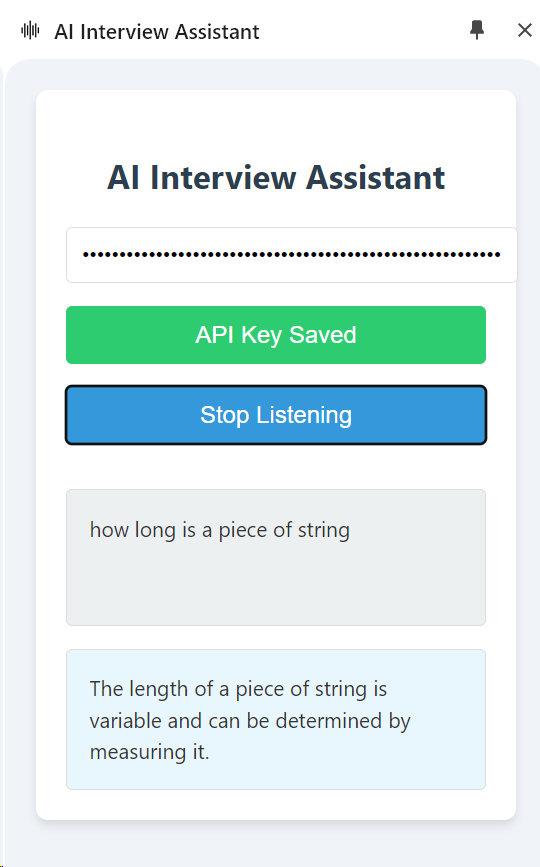

# AI Interview Assistant Chrome Extension

## Overview

The AI Interview Assistant is a Chrome extension designed to help users during interviews or meetings by providing real-time AI-powered responses to questions. It listens to the audio from the current tab, transcribes the speech, identifies questions, and generates concise answers using OpenAI's GPT model.

	

## Features

- Real-time audio capture from the current tab
- Speech-to-text transcription
- Question detection
- AI-powered responses using OpenAI's GPT-3.5-turbo model
- Persistent side panel interface
- Secure API key storage

## Installation

### Prerequisites

- Google Chrome browser (version 114 or later)
- An OpenAI API key

### Steps

1. Clone this repository or download the source code as a ZIP file and extract it.

2. Open Google Chrome and navigate to `chrome://extensions/`.

3. Enable "Developer mode" by toggling the switch in the top right corner.

4. Click on "Load unpacked" and select the directory containing the extension files.

5. The AI Interview Assistant extension should now appear in your list of installed extensions.

## Usage

1. Click on the AI Interview Assistant icon in the Chrome toolbar to open the side panel.

2. Enter your OpenAI API key in the provided input field and click "Save API Key".

3. Click "Start Listening" to begin capturing audio from the current tab.

4. As questions are detected in the audio, they will appear in the "Transcript" section.

5. AI-generated responses will appear in the "AI Response" section.

6. Click "Stop Listening" to end the audio capture.

## Privacy and Security

- The extension only captures audio from the current tab when actively listening.
- Your OpenAI API key is stored securely in Chrome's storage and is only used for making API requests.
- No audio data or transcripts are stored or transmitted beyond what's necessary for generating responses.

## Troubleshooting

- Ensure you have granted the necessary permissions for the extension to access tab audio.
- If you're not seeing responses, check that your API key is entered correctly and that you have sufficient credits on your OpenAI account.
- For any issues, please check the Chrome developer console for error messages.

## Contributing

Contributions to the AI Interview Assistant are welcome! Please feel free to submit pull requests or create issues for bugs and feature requests.

## License

[MIT License](LICENSE)

## Disclaimer

This extension is not affiliated with or endorsed by OpenAI. Use of the OpenAI API is subject to OpenAI's use policies and pricing.
